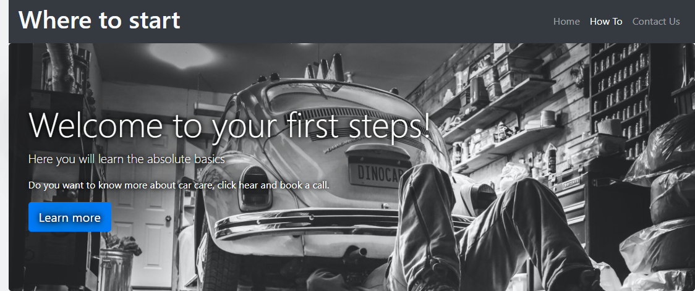
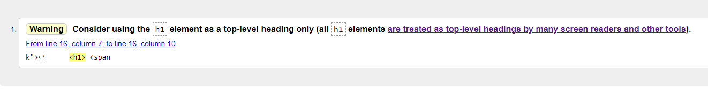

This website was a struggle, throughout the course I've been stuck on certain 
objects or struggling to remember certain parts of the code aswel as half way 
through this project, I was in a severe accident that threatened my life. The injuries
I sustained from this cause me to be unable to type or look at a screen for too long or even
remember what was happening. My memory was limited, and my attention span was gone.
I was in an out of hospital like a yoyo but through pure determination I managed to complete this 
project, even though it is a late submission after getting a medical note to say extend the deadline
but wasn't approved, I got it done.

The idea for this project came from a person in slack, I was stuck staring at a wall for two hours 
and finally crashed. I asked the general chat in slack and this kind man gave me the idea to do something 
with cars. I trained as a mechanic from young but found a new passion for computers and decided to pursue it.
I found the idea of adding the "change tire section" in the video, this person asked sixty people in
an office and over fifty people said no. This absolutely blew me away, then I asked my best friend 
if he thought of it, and he said good followed by him saying that oil in the car runs out and u need 
to top it up. I mean, I knew people didn't know everything about cars, but this was just ridiculous
to me. I'm not trying to say I'm the best car fixer to ever walk the earth, but I said I'd try
my finest to teach people the absolute basics. This is the website on the am I responsive

Page Layouts
The first thing you are greeted with is a quick message and the nav bar for going around the site's pages.
This layout for the top was actually designed by bootstrap. Now I know bootstrap is slightly frowned 
upon because people will just use bootstraps integrated HTML, CSS and the most difficult part the 
media queries but as you can see from my code this is not the case for me. I integrated my own CSS
and media for nearly all screen sizes.  and this style carries on 
throughout the site, as shown here  .
The purpose of this was to create stability and structure across the site, with changed background 
to just add the small element of style to it, last thing I wanted was people getting too overwhelmed 
at the beginning and leaving. The whole idea was to get people who now days have a very short attention
span. I know this because I myself struggle with this.

Then the sites move down into the main informative part of the page, this is the most text heavy part of the 
site, I tried to make this easier on the eyes and interactive enough to where it's difficult to not get bored.
I achieved this by in the index. HTML by adding a short twenty-second video of someone checking their oil
 and in the how-to.html I added YouTube videos for some mabey further 
explain on what I was trying to say like this  .
The idea of adding videos I felt was a good way of breaking up the paragraphs. Finally, at the bottom 
of all the pages, you have the same layout across the three pages. This creates a level of stability 
and support.  in this image, the map doesn't load for some reason but 
works on other devices.

Testing 

Once I got my code up to date and the layout of the site finished, I sent the link for my site to
my family, friends, and I.
I went through it on all different device screens and different quality devices, the only problem
I encountered was on slower devices the nav bar was delayed opening but worked perfect.

Validator Testing 

Testing the project was for me the most confusing part of the project, I didn't know to run it off 
lighthouses or by grabbing the link and trying it on other devices or what to do, but I'm done everything 
I could to test it.
Lighthouse result for mobiles  
lighthouse result for desktops 

I ran my code through the code validator and here are the results

HTML  
      
      
     The only problem is a warning sign on a h1, but that is need, so the warning is ignored in this case.

CSS 

Bugs
 
The only major bug I've come across is the bottom of my pages where my map doesn't load for me 
but does for everyone else

Another thing I found to be slightly a bug, I tried a lot of difficult code that I didn't commit in case something went
wrong and as I predicted it did, so I commit showing my working and had to revert all my changes to 
make my site usable again.

Deployment

I uploaded my site to GitHub servers by going to setting then GitHub pages and launching it.
The link it provided me with is url(https://aaronlyons1.github.io/my-first-project/) this is the 
link I sent to my family for them to view the website.
I learned to upload the site by using one of the code institute videos.

Credits

Content

As I have stated, I have used url(https://getbootstrap.com/docs/4.6/getting-started/introduction/) 4 
in my code, I was advised to do so about halfway through my code this was to make it easier on me 
when it came to making my site look its best.

The contact page was code that my fiend showed me years ago, and I replicated it to the best of my ability.

Media

I have got all of my images seen on the site from url(https://www.pexels.com/). The rest of my pictures 
are my own screenshots.

The small video I have on my home page is from a website called url(https://coverr.co/)

The two videos I have in my how-to section are YouTube videos  credit to : url(https://youtu.be/PMIjgDJnDek)
                                                                       and url(https://youtu.be/zmwLj1pnreg)

